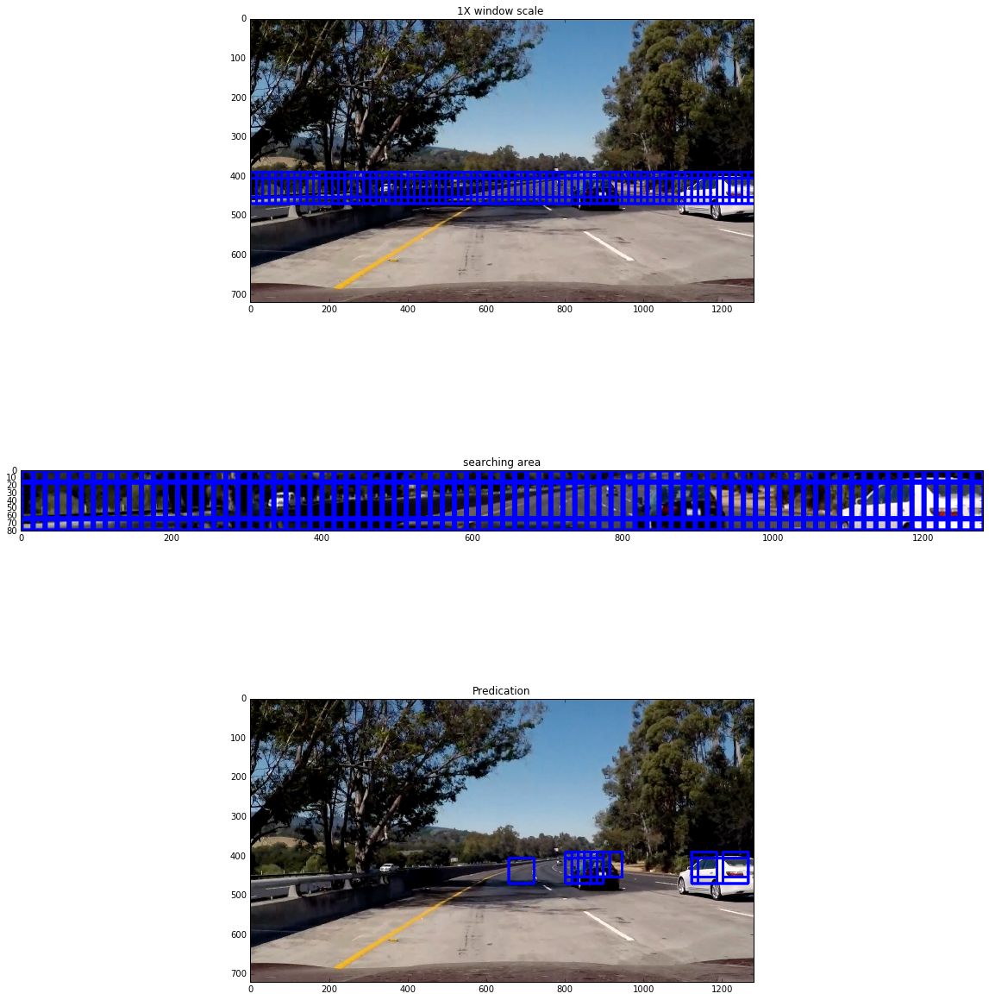
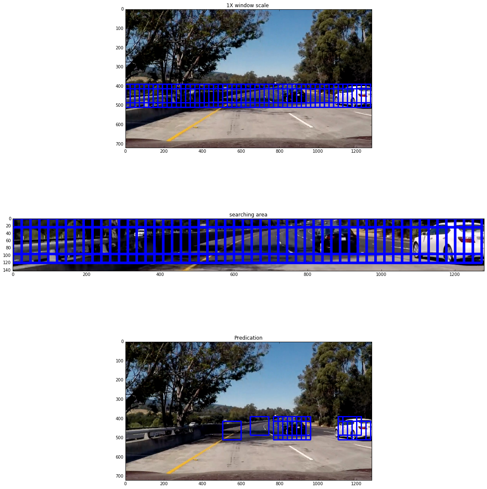
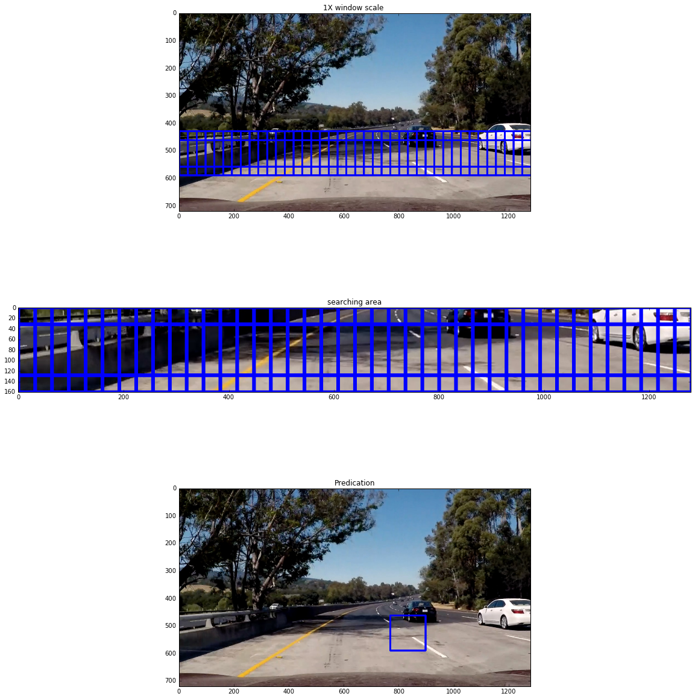
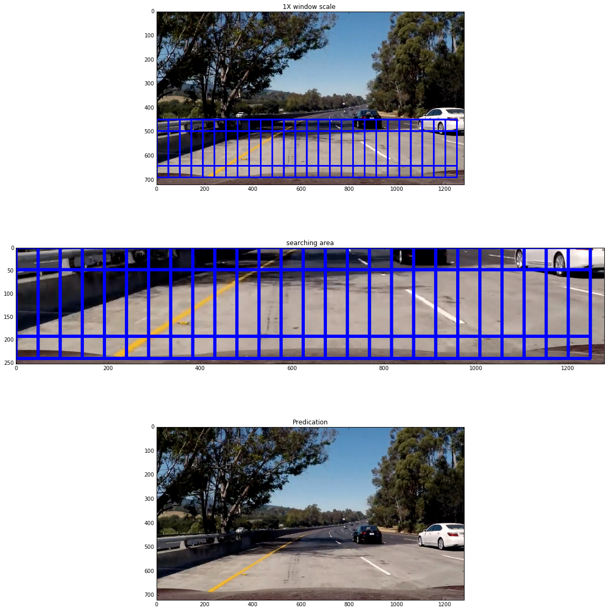
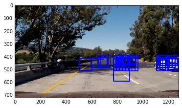
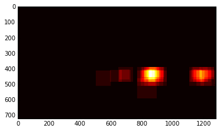
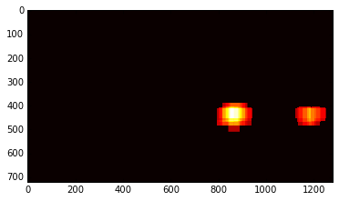
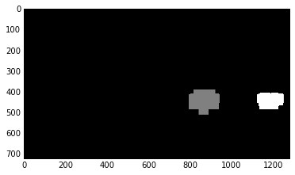
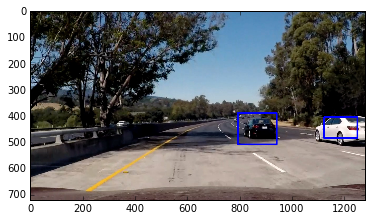
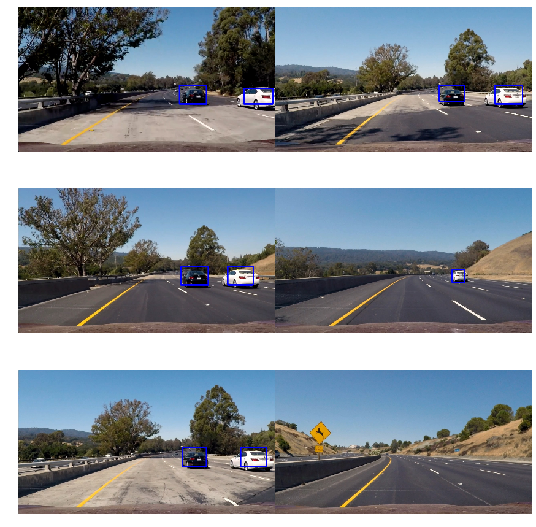

# CarND-Vehicle-Detection

---

**Vehicle Detection Project**

In the project, I implemented traditional computer vision to achieve vehicle detection on the road. The traditional computer vision technique for object
detection contains feature extraction, spatial sampling and classification. Different algorithms are applied on these stages and the parameters
for these stages tuned by hand.

The goals / steps of this project are the following:

* Perform a Histogram of Oriented Gradients (HOG) feature extraction on a labeled training set of images and train a classifier Linear SVM classifier
* Optionally, you can also apply a color transform and append binned color features, as well as histograms of color, to your HOG feature vector. 
* Note: for those first two steps don't forget to normalize your features and randomize a selection for training and testing.
* Implement a sliding-window technique and use your trained classifier to search for vehicles in images.
* Run your pipeline on a video stream (start with the test_video.mp4 and later implement on full project_video.mp4) and create a heat map of recurring detections frame by frame to reject outliers and follow detected vehicles.
* Estimate a bounding box for vehicles detected.

### Features Extraction 

For the first stage, feature extraction, three kinds of feature are extracted from images： HOG, binned color feature and histograms of color.

In order to extract the feature of vehicle and non-vehicle objects, the training dataset need to feed in feature extraction stage, the below figures are vehicle:

And non-vehicle figures like following:

The size of training images is 64X64 pixels. 

**Histogram of Oriented Gradients (HOG)**
HOG is a [technique counts occurrences of gradient orientation in localized portions of an image](https://en.wikipedia.org/wiki/Histogram_of_oriented_gradients)
In the stage, extracting HOG features is implemented by function **_get_hog_features_**. The below figures are some vehicle images and corresponding HOG feature images:

And also following figures are non vehicle images and corresponding HOG feature images:

What's more, binned color features and histograms of color features is applied on the stage. 

So several paramters need to be tuned to fit vehicle and non-vehicle detection, such as HOG orientations, HOG pixel per cell, HOG cells per block, spatial bining dimensions, number of hisogram bins. 

Because there is a difference in magnitude between color-based and gradient-based features, so a normalization step may prevent one type from dominating the other. 

In the projecet, **_standardScaler()_** method is applied for normalizing among features.

And before feeding train dataset into linear support vect machine(SVM) classifier, random shuffling training dataset is necessary to prevent from overfitting.

In order to find out the parameters that can achieve highest predict accuracy, the below table I explore different parameter combination is show:

|Color space|Orient|Pixels per Cell|Cells per Block|Hog Channel|Spatial Size|Hist Bins|Feature Extract Time|Train Time|Accuracy|
|:---------:|:-----:|:-----------:|:-------------:|:---------:|:----------:|:-------:|:------------------:|:------:|:---------:|
| HSV   |   9 |  8  |   2  | 0  | (16,16) | 16  |79.47|12.55|95.16|
| HSV   |   9 |  8  |   2  | 1  | (16,16) | 16  |69.47|10.31|96.42|
| HSV   |   9 |  8  |   2  | 2  | (16,16) | 16  |64.69|13.54|96.03|
| HSV   |   9 |  8  |   2  | ALL| (16,16) | 16  |189.34|23.78|97.49|
| RGB   |   9 |  8  |   2  | ALL| (16,16) | 16  |167.07|40,72|95.41|
| LUV   |   9 |  8  |   2  | 0  | (16,16) | 16  |67.25|11.6|96.11|
| LUV   |   9 |  8  |   2  | 1  | (16,16) | 16  |63.09|13.84|96.65|
| LUV   |   9 |  8  |   2  | 2  | (16,16) | 16  |66.19|16.57|95.52|
| LUV   |   9 |  8  |   2  | ALL| (16,16) | 16  |175.58|26.49|97.78|
| HLS   |   9 |  8  |   2  | 0  | (16,16) | 16  |64.36|12.31|95.5|
| HLS   |   9 |  8  |   2  | 1  | (16,16) | 16  |71.6|11.65|96.09|
| HLS   |   9 |  8  |   2  | 2  | (16,16) | 16  |78.79|11.92|95.05|
| HLS   |   9 |  8  |   2  | ALL| (16,16) | 16  |163.53|32.34|97.38|
| YUV   |   9 |  8  |   2  | 0  | (16,16) | 16  |66.41|15.66|95.5|
| YUV   |   9 |  8  |   2  | 1  | (16,16) | 16  |60.54|12.85|95.78|
| YUV   |   9 |  8  |   2  | 2  | (16,16) | 16  |63.72|17.4|93.38|
| YUV   |   9 |  8  |   2  | ALL| (16,16) | 16  |174.7|32.4|97.72|
| YCrCb |   9 |  8  |   2  | 0  | (16,16) | 16  |62.2|15.51|95.38|
| YCrCb |   9 |  8  |   2  | 1  | (16,16) | 16  |57.88|12.58|95.75|
| YCrCb |   9 |  8  |   2  | 2  | (16,16) | 16  |73.25|15.41|94.14|
| YCrCb |   9 |  8  |   2  | ALL| (16,16) | 16  |162.03|27.14|97.89|
| YUV   |  11 |  16 |   2  | ALL| (16,16) | 16  |72.99|7.03|97.72|
| YCrCb |  11 |  16 |   2  | ALL| (16,16) | 16  |83.25|8.17|97.75|
| LUV   |  11 |  16 |   2  | ALL| (16,16) | 16  |85.34|6.38|98.28|
| LUV   |   7 |  8  |   2  | ALL| (16,16) | 16  |157.97|22.79|98.23|
| LUV   |   9 |  12 |   2  | ALL| (16,16) | 16  |88.15|11.23|98.09|
| LUV   |   9 |  16 |   2  | ALL| (16,16) | 16  |79.45|5.48|97.8|
| LUV   |  11 |  8  |   2  | ALL| (16,16) | 16  |202.36|35.89|98.24|
| LUV   |  11 |  12 |   2  | ALL| (16,16) | 16  |101.96|10.62|98.17|
| LUV   |  11 |  8  |   2  | ALL| (32,32) | 32  |126.02|33.7|98.4|

From the above table, it is easy to see that HOG channel have a significant effect on features extract time and predict accurary. In order to achieve 98 % or higher accuracy, extracting all hog channel is necessary. 
And considering the trade off between speed and accuracy of linear SVM classifier, I will set accuracy at highest priority. 
So the final parameters I chosen in the table above is: LUV color space, 11 HOG orientations, 8 pixels per cell, 2 cells per block, ALL hog channels, 32X32 spatial size, 32 histogram bins. 

### Sliding Window Search
In the stage, I implemented a function called **_find_cars_**, which is modified from course's material. The function combine features extraction, sliding window and object prediction. Rather than searching whole image, the algorithm select specific area in the image with corresponding scaling factor that impacts the searching window size. In each step, the subsampled image feed into features extraction function. The function will performance prediction on features vector for each sub-images on the searching area and return rectangles list. 

The strategy I applied is that beacause objecet will become smaller when object is more far away from observer, so in the project car will become smaller when it is more far away from camera. We take advantage of the above knowledge that searching area with smaller window scale will have narrow area and value in y axis is smaller. In the same way, when vehicle is close to camera, the window scale is large and searching area have larger are and value in y axis is larger and close to bottom. 
The following table is several configuration for window scales and corresponding searching areas:

| Configuration |window scale | y start |  y stop |
|:-------------:|:-----------:|:-------:|:-------:|
|        1      |       1     |    390  |   470  |
|        2      |      1.2    |    390  |   494  |
|        3      |      1.5    |    390  |   532  |
|        4      |      2.0    |    430  |   590  |
|        5      |      3.0    |    460  |   702  |

The below figures are corrsponding for configuration 1,2,3,4,5:

Furthermore, I combined the above configurations for each image, in other world I draw rectangles of each configurations into one image. so the the result like following figure:

We can see from above figure that there are some rectangles draws on the area where doesn't have any vehicle. the reason is that our linear SVC classifier is not perfect, so it is possible that there are some misclassification. But compared with correct overlapping detections, the number of rectangles for misclassification is smaller, it give us a chance to filter it out. 

The technique I applied for this issue is to build a heat-map from detections in order to combine overlapping detections and remove false positives.

The function **_add_heat_** is to add "heat" (+=1) for all pixels within windows where a positive detection is reported by classifier. The figure after feed into **_add_heat_** function is shown following:

Then by applying **_apply_threshold_** method(in the example, with value 4), setting all pixel that don't exceed threshold to zero, the figure is following:

And **_label_** function from library **_scipy.ndimage.measurements_** lebel heat map image, like below figure:

Then, **_draw_labeled_bboxes_** draw the rectangles into original image:

The result of passing all of test images by applying above pipeline are shown in following:

Acutally, at beginning, the pipeline will cause some false positives on some images because the various false positives is difficult to apply same threshold for each image. So my solution is that I applying threshold technique for each searching areas. From above table, I have 5 different searching area configurations, each configuration will be processed by heatmap, applying threshold, label. The method will make sure the false positives from each configuration will limited to small value, rather than false positives accumulate from each configuration to a large number, which will be hard filter it out. 

### Video  Implementation
Compared with static image processing, video is formed by continous time-series images and normally video is filmed at least 24 frames per second. So the positions of detected object(Vehicle) between two time-adjacent frames are quite similar. I take advantage of above knowledge to define a method **_video_processing_pipeline_** and a class **_Vehicle_Detect_** (the idea is inspired by udacity alumni  [Jeremy shannon](https://github.com/jeremy-shannon/CarND-Vehicle-Detection/blob/master/README.md)). **_Vehicle_Detect_** keep tracking the previous 12 frames rectangles and store those in to list **_pre_rects_**. **_video_processing_pipeline_** draw the reactangles from previous 12 frames into current frame. Then apply heatmap, threshold and lebel to filter out false position. So in this way the rectangles shown on video are stable in position and size. 

Here is a like to .[project video](https://youtu.be/7xVx7FraP2w)

### Discussion
From the project, I learn traditional computer vision method to achieve vehicle detection, which is a great and fun experience to explore and optimize the solution. Finally I completed the project, however it is still not perfect and have several problems: 

    1. The video created by my algorithms have some glitch, in other word, it have few false positive on some frames. 
    It is possible caused by extracting feature and training classifier part. Because I didn't consider time-series issue,
    it may cause the classifier is overfitting. So I will continue to explore solution for the issue.
    
    2. The pipeline is inefficient and can't runs in real time. the reason is that when the highest priority of deciding 
    the parameters for extracting feature is accuracy, which sacrificed speed of classifier. Exploring the parameter to
    speed it up and keep high accuracy is next step for me. 
    

