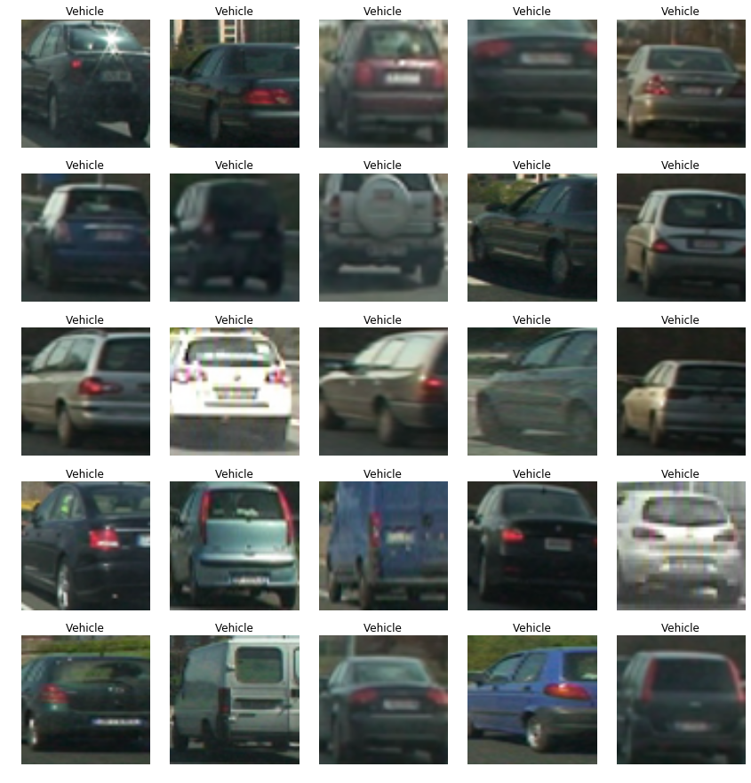
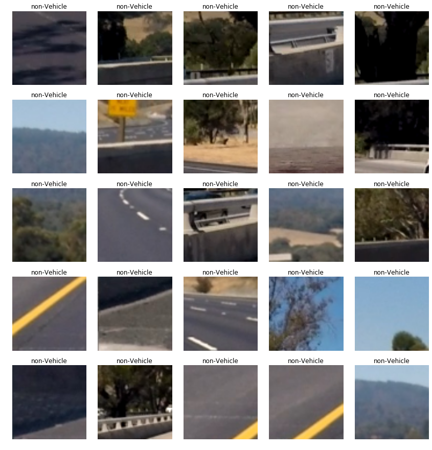
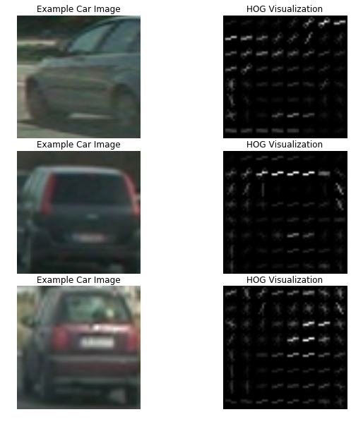
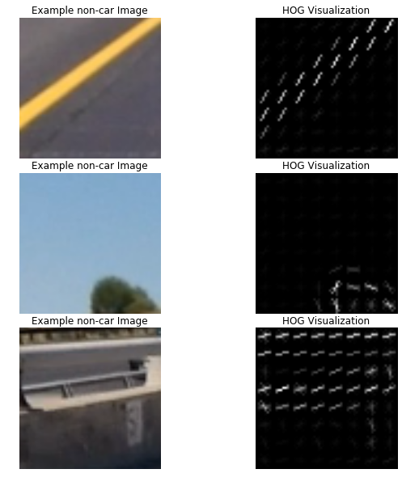

# CarND-Vehicle-Detection

---

**Vehicle Detection Project**

In the project, I implemented traditional computer vision to achieve vehicle detection on the road. The traditional computer vision technique for object
detection contains feature extraction, spatial sampling and classification. Different algorithms are applied on these stages and the parameter
for these stages tuned by hand.

The goals / steps of this project are the following:

* Perform a Histogram of Oriented Gradients (HOG) feature extraction on a labeled training set of images and train a classifier Linear SVM classifier
* Optionally, you can also apply a color transform and append binned color features, as well as histograms of color, to your HOG feature vector. 
* Note: for those first two steps don't forget to normalize your features and randomize a selection for training and testing.
* Implement a sliding-window technique and use your trained classifier to search for vehicles in images.
* Run your pipeline on a video stream (start with the test_video.mp4 and later implement on full project_video.mp4) and create a heat map of recurring detections frame by frame to reject outliers and follow detected vehicles.
* Estimate a bounding box for vehicles detected.

### Features Extraction 

For the first stage, feature extraction, three kinds of feature are extracted from images： HOG, binned color feature and histograms of color.

In order to extract the feature of vehicle and non-vehicle objects, the training dataset need to feed in feature extraction stage, the below figures are vehicle:

And non-vehicle figures like following:

The size of training images is 64X64 pixels. 

**Histogram of Oriented Gradients (HOG)**
HOG is a [technique counts occurrences of gradient orientation in localized portions of an image](https://en.wikipedia.org/wiki/Histogram_of_oriented_gradients)
In the stage, extracting HOG features is implemented by function **_get_hog_features_**. The below figures are some vehicle images and corresponding HOG feature images:

And also following figures are non vehicle images and corresponding HOG feature images:

